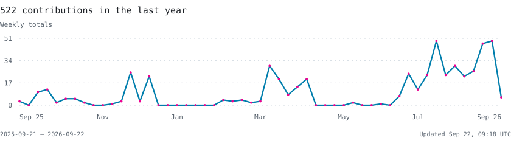

<picture>
  <source media="(max-width: 600px) and (prefers-color-scheme: dark) and (prefers-reduced-motion: reduce)" srcset="assets/header-dark-compact-static.svg">
  <source media="(max-width: 600px) and (prefers-reduced-motion: reduce)" srcset="assets/header-light-compact-static.svg">
  <source media="(max-width: 600px) and (prefers-color-scheme: dark)" srcset="assets/header-dark-compact.svg">
  <source media="(max-width: 600px)" srcset="assets/header-light-compact.svg">
  <source media="(prefers-color-scheme: dark) and (prefers-reduced-motion: reduce)" srcset="assets/header-dark-static.svg">
  <source media="(prefers-color-scheme: light) and (prefers-reduced-motion: reduce)" srcset="assets/header-light-static.svg">
  <source media="(prefers-color-scheme: dark)" srcset="assets/header-dark.svg">
  
</picture>

  <strong>Linux & DevOps Platforms Intern @ GlassHouse</strong> 
  Istanbul, Türkiye

  I build reproducible Linux and Kubernetes environments and automate infrastructure. 
  CI/CD, GitOps, practical observability, and clear documentation.

  <code>Linux</code> · <code>Kubernetes</code> · <code>Docker</code> · <code>Ansible</code> · <code>Terraform</code> · <code>Jenkins</code> · <code>Prometheus</code> · <code>Grafana</code>

<a href="https://github.com/ozalpslan?tab=overview">
  <picture>
    <source media="(max-width: 600px) and (prefers-color-scheme: dark)" srcset="assets/activity-dark-compact.svg">
    <source media="(max-width: 600px)" srcset="assets/activity-light-compact.svg">
    <source media="(prefers-color-scheme: dark)" srcset="assets/activity-dark.svg">
    
  </picture>
</a>

  <a href="https://www.linkedin.com/in/alper-ozarslan/">LinkedIn</a> &nbsp; / &nbsp;
  <a href="https://github.com/ozalpslan?tab=repositories">Repositories</a>

